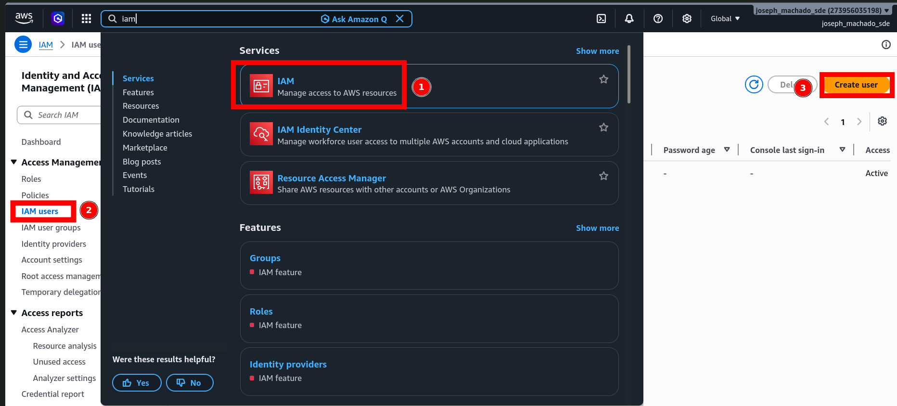
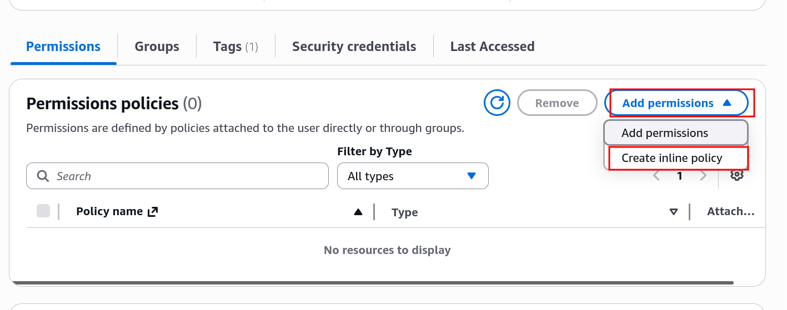
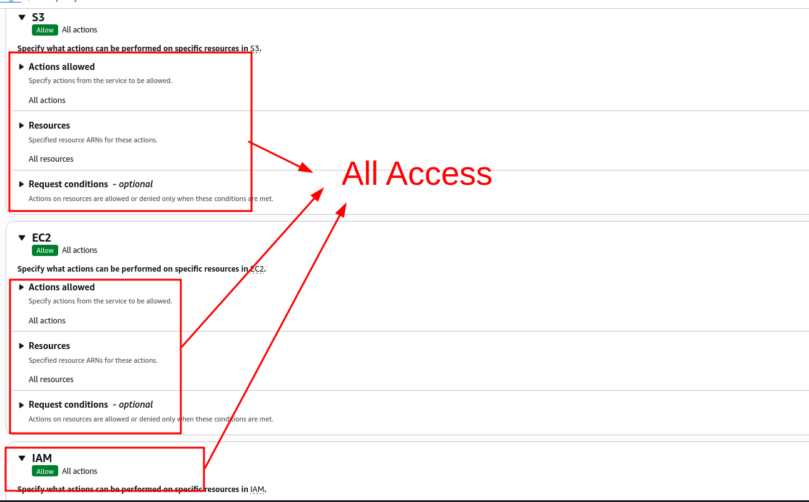

# Learn IAC for data engineering with Terraform

## Setup 

### Prerequisites

1. [AWS Account with root access](https://signin.aws.amazon.com/signup?request_type=register)
2. [Terraform](https://developer.hashicorp.com/terraform/tutorials/aws-get-started/install-cli)
3. [AWS cli](https://docs.aws.amazon.com/cli/latest/userguide/getting-started-install.html)
4. [AWS cli setup](https://docs.aws.amazon.com/cli/latest/userguide/getting-started-quickstart.html)

### Grant permissions to your AWS cli Account

#### Create an IAM user 



#### Create an Inline Policy 



#### Grant Full S3, EC2, IAM access to the Inline Policy



> [!CAUTION]
> This is not recommended for production use cases


## Create infrastructure 

Initialize terraform as shown below 

> [!WARNING]
> Change the bucket name at [dev.tfvars](./terraform/envs/dev.tfvars)

```bash 
terraform -chdir=terraform init -var-file=envs/dev.tfvars
terraform -chdir=terraform validate -var-file=envs/dev.tfvars
terraform -chdir=terraform fmt -var-file=envs/dev.tfvars
```

Check that S3 and EC2 are working as expected.

```bash
aws s3 ls 
aws ec2 describe-instances \
  --filters "Name=instance-state-name,Values=running" \
  --query 'Reservations[].Instances[].{ID:InstanceId, Name:Tags[?Key==`Name`].Value, Type:InstanceType, State:State.Name, PublicIP:PublicIpAddress, PrivateIP:PrivateIpAddress}' \
  --output table
```

Let's look at the state file 

```bash 
cat terraform/terraform.tfstate |jq -r '.resources[] | [.type, .name] | join(",")'
# or 
terraform -chdir=terraform state list
```

## Destroy infrastructure 

Once done, don't forget to destroy infrastructure as shown below.

```bash 
terraform -chdir=terraform destroy -var-file=envs/dev.tfvars
```
